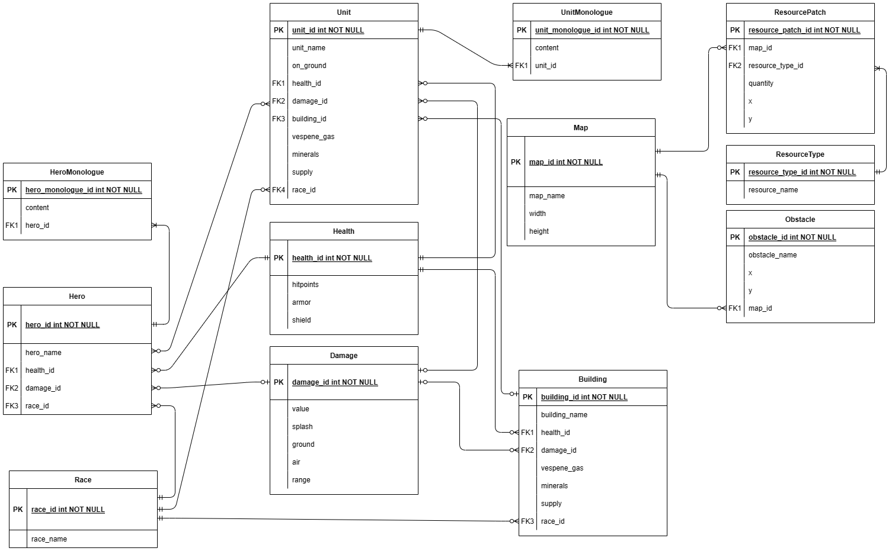
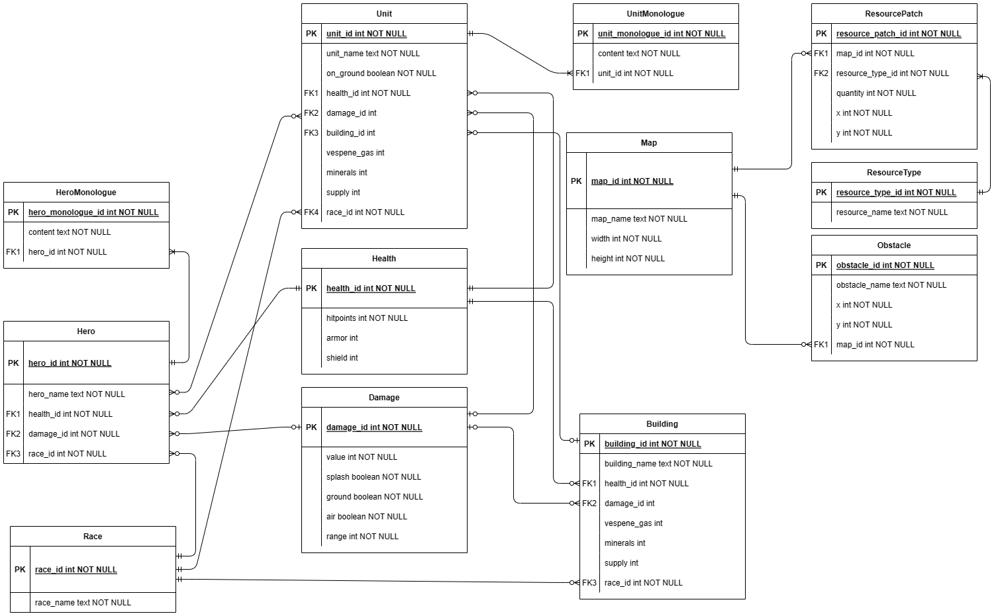

# Курсовая работа по ИСБД

**ФПИиКТ, СППО**

Выполнили:

- Ермаков Тимофей Сергеевич, P33092

- Гадеев Руслан Рустамович, P33082

## Цель курсовой работы 
Получение навыков и знаний, необходимых для создания и реализации проекта базы данных на основе выбранной произвольной предметной области и веб-приложения, использующего разработанную базу данных.

## Требования к ER-модели и БД
1.	ER-модель должна соответствовать представленному описанию предметной области. 
2.	ER-модель базы данных должна включать в себя не менее 10 сущностей, содержать хотя бы одно отношение «многие-ко-многим». 
3.	В качестве СУБД должна использоваться СУБД PostgreSQL. Для реализации БД и вспомогательных средств должны использоваться языки SQL и PL/pgSQL База данных должна быть развернута на сервере helios. 
4.	Веб-приложение, использующее разработанную базу данных, должно быть развернуто на сервере helios. 
5.	Взаимодействие с БД/запуски запросов и скриптов должны осуществляться через psql. 

## Этапы

### Этап 1 
1. [x] Выбрать предметную область для дальнейшего построения базы данных и веб-приложения.
2. [x] Согласовать предметную область с преподавателем.
3. [x] Сделать подробное описание предметной области. 

### Этап 2 
1. [x] Нарисовать ER-диаграмму предметной области. ER-модель должна соответствовать описанию, представленному в рамках первого этапа курсовой работы.
2. [x] На основе ER-модели построить даталогическую модель.

### Этап 3
Реализовать даталогическую модель в реляционной СУБД PostgreSQL:
1. [x] Создать необходимые объекты базы данных.
2. [ ] Заполнить созданные таблицы тестовыми данными.
3. [x] Сделать скрипты для:
    - создания/удаления объектов базы данных;
    - заполнения/удаления созданных таблиц.
4. [ ] Обеспечить целостность данных при помощи средств языка DDL.
5. [ ] Добавить в базу данных триггеры для обеспечения комплексных ограничений целостности.
6. [ ] Реализовать функции и процедуры на основе описания бизнес-процессов (из этапа №1).
7. [ ] Произвести анализ использования созданной базы данных:
    - выявить наиболее часто используемые запросы к объектам базы данных;
    - результаты представить в виде текстового описания.
8. [ ] Создать индексы и доказать, что они полезны для вашей базы данных:
    - доказательство должно быть приведено в виде текстового описания.

## Описание курсовой работы
Создание веб-сайта, позволяющего пользователю-игроку разобраться и расширить свои знания в механике и лоре компьютерной игры в жанре стратегии в реальном времени “StarCraft”, разработанной компанией “Blizzard Entartainment” в 1998 году.

## Этап 1

### Описание предметной области
_"Стороны конфликта представлены тремя игровыми расами: терранами, протоссами и зергами. Одним из важнейших новшеств игры является различие между воюющими сторонами при соблюдении баланса сил. StarCraft — одна из первых стратегий в реальном времени, в которой каждая сторона отличается не только внешним видом, но и характеристиками своих представителей, а также общей стратегией боя. Протоссы располагают мощными, но дорогостоящими воинами и техникой, а зерги превосходят противника за счёт численности и скорости. При прочих равных условиях ни у одной расы нет весомого преимущества перед другой. К таким условиям можно отнести количество и расположение ресурсов в непосредственной близости к первой базе, оборонительные условия местности, расположение по отношению к другим игрокам."_ 

[Wikipedia](https://ru.wikipedia.org/wiki/StarCraft)

## Этап 2

### ER-модель

### Даталогическая модель

## Этап 3

[SQL-скрипты](https://github.com/Deltaspace0/database-kursovaya/tree/master/scripts)

### Анализ использования созданной базы данных

### Доказательство полезности индексов

